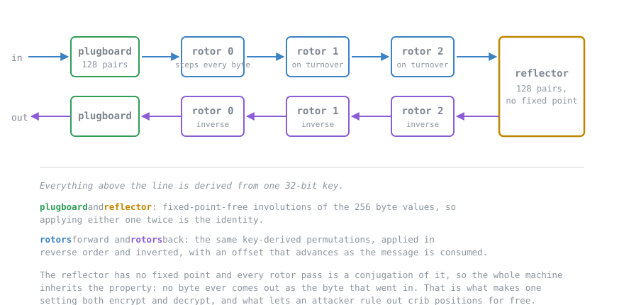

# byte-enigma

[](https://github.com/qnicondavid/byte-enigma/actions/workflows/build.yml)
[](LICENSE)
[](https://jitpack.io/#qnicondavid/byte-enigma)

A rotor cipher over bytes, and the code that breaks it.

The cipher has a 32-bit key. That is the entire secret, and this repository contains a search that
walks all four billion of them and gets the plaintext back. Both halves are the point: the interesting
part of a rotor machine is not that it enciphers, it is how it dies.

The whole keyspace has been swept, ciphertext only, with no crib and no hint about where to look. The
true key came first out of 4,294,967,296, by 206 log-units. [The log is in the repository.](docs/keyspace-sweep.md)

```
$ byte-enigma demo
...
  crib, known plaintext
    key:        -1722875331  (correct)
    plaintext:  THE ENEMY FLEET WILL SAIL AT DAWN AND ATTACK THE SOUTHERN HARBOUR ...
    rate:       383,173 keys/sec, so 2^32 projects to 3.11 h
```



## What this is not

**It is not an Enigma simulator.** It will not decrypt a wartime message and it will not match a
historical test vector. The alphabet is 256 symbols rather than 26, the rotor wirings are derived
from the key rather than taken from the eight catalogue rotors, there are no ring settings, and the
stepping is a plain odometer with no double-stepping anomaly. It borrows Enigma's shape (plugboard,
rotor stack, reflector, back out again) and nothing else. [ADR 0001](docs/adr/0001-derived-wiring-over-historical-rotors.md)
records why.

**It is not a secure cipher and is not on its way to becoming one.** A 32-bit key is small enough to
enumerate in an afternoon, there is no authentication, and the passphrase derivation is a hash rather
than a KDF. Do not put anything in it that you would mind seeing published. If you need real
encryption, use libsodium, or `javax.crypto` with AES-GCM, or age.

**It is not a portfolio demo of a cipher.** The library that might actually be worth depending on is
`io.github.qnicondavid.byteenigma.search`, which brute-forces a 32-bit keyspace across threads and
knows nothing about rotors. See [Using it as a library](#using-it-as-a-library).

## Getting it

Download `byte-enigma.jar` from [the latest release](https://github.com/qnicondavid/byte-enigma/releases/latest)
and run it. There are no dependencies to fetch.

```
java -jar byte-enigma.jar demo
```

Or build it yourself; you need JDK 17 or newer and Maven.

```
git clone https://github.com/qnicondavid/byte-enigma.git
cd byte-enigma
mvn -q -Pdist package
java -jar core/target/byte-enigma.jar demo
```

## What the demo shows

Two things, in order.

**Reusing a key without a nonce.** Two messages are enciphered under one key. Wherever the plaintexts
agree, the ciphertexts agree, byte for byte, because the rotor offsets come from the key alone and so
byte *i* of every message meets the same permutation. The demo counts the positions. Sealing with a
nonce moves the offsets per message and the correspondence disappears.

**Recovering a key nobody was told.** A key is drawn at random, a message is enciphered under it, and
the key is thrown away. The search then recovers it twice: once with a crib, once from the ciphertext
alone by scoring English quadgrams. It prints the measured rate both times.

The demo searches a window of about a million keys so it finishes while you are watching. The window
is the only thing scaled down; the same code handed the full range sweeps the full range, which is
what [docs/keyspace-sweep.md](docs/keyspace-sweep.md) records: 4,294,967,296 keys in 2.03 hours
across two machines, which projects to 1.48 hours on sixteen threads alone.

## The two attacks

**Crib, known plaintext.** You supply a fragment you expect to find and where you expect it. A wrong
key fails on the first byte with probability 255/256, so the search decrypts only the window the crib
covers rather than the whole message.

Before any key is tried, most candidate positions can be thrown away for free. The cipher can never
map a byte to itself, so if the crib and the ciphertext agree anywhere inside a candidate window, the
crib cannot sit there. The same reciprocity that lets one setting both encrypt and decrypt is what
hands the attacker that discount, and it is the flaw Bletchley Park leaned on hardest.

```
# which positions are still possible, before trying a single key
byte-enigma offsets --crib "ATTACK AT DAWN" --in message.b64

# then sweep one of them
byte-enigma break --crib "ATTACK AT DAWN" --at 0 --in message.b64
```

**Quadgrams, ciphertext only.** No crib. The search decrypts under every key and keeps whichever
result reads most like English, scored against a table of four-letter frequencies built from
about 670,000 words of public-domain prose. It assumes only that the plaintext is English, which is a
far weaker assumption than knowing a fragment of it, and it is roughly how most real traffic was read.

```
byte-enigma break --language --in message.b64 --top 5
```

It is slower than the crib attack, but only by 40% on a 234-byte message, even though the crib looks
at 18 bytes and this looks at all 234. Both spend most of their time rebuilding the key schedule,
which neither can avoid. [docs/keyspace-sweep.md](docs/keyspace-sweep.md) has both measurements.

## Using it as a library

Available through [JitPack](https://jitpack.io/#qnicondavid/byte-enigma).

```xml
<repositories>
  <repository>
    <id>jitpack.io</id>
    <url>https://jitpack.io</url>
  </repository>
</repositories>

<dependency>
  <groupId>com.github.qnicondavid.byte-enigma</groupId>
  <artifactId>byte-enigma</artifactId>
  <version>v1.1.0</version>
</dependency>
```

The part worth reusing is `SeedSweep`, which has no idea a cipher exists. It owns the range, the
worker threads, the leaderboard and the clock; you supply a factory for whatever gets rekeyed and an
evaluator that scores one candidate. Point it at something else and it will brute-force that instead.

```java
SeedSweep<MyThing> sweep = new SeedSweep<>(MyThing::new, 10);

SweepResult result = sweep.sweepParallel(
        SeedSweep.KEYSPACE_START, SeedSweep.KEYSPACE_END, ciphertext,
        (key, thing, ciphertext, scratch) -> {
            thing.rekey(key);
            int length = thing.apply(ciphertext, scratch);
            return Candidate.of(key, score(scratch, length), scratch, length);
        });

System.out.println(result.top().key() + " at " + result.keysPerSecond() + " keys/sec");
```

The factory rather than an instance is deliberate: the sweep needs one subject per thread, and taking
a factory makes it impossible to hand it a mutable cipher that four threads then share.

The cipher itself, if you want it anyway:

```java
ByteEnigma machine = ByteEnigma.fromPassword("hunter2", 3);

byte[] sealed = Envelope.seal(machine, plaintext);   // fresh nonce, prepended in the clear
byte[] opened = Envelope.open(machine, sealed);

byte[] raw = machine.transform(plaintext);           // textbook mode, self-inverse, leaks on reuse
```

`ByteEnigma` is **not thread-safe**. Rotor offsets are mutable state and a transform walks them, so
use one instance per thread.

## Layout

```
core/                the cipher, the search, the breaker, the command line
benchmarks/          JMH benchmarks, in the reactor build so they cannot rot unnoticed
data/corpus/         public-domain English the quadgram table is generated from
docs/                the decision record, how the cipher falls, the full keyspace sweep
```

Inside `core`:

| Package | What is in it |
|---|---|
| `...byteenigma.cipher` | `ByteEnigma`, `Envelope`, and the rotors and involutions behind them |
| `...byteenigma.search` | `SeedSweep` and friends. Knows nothing about ciphers. |
| `...byteenigma.breaker` | `CribMatcher`, `QuadgramSearch`, `QuadgramScorer`. The parts that do know. |
| `...byteenigma.cli` | Argument parsing and the subcommands |

## Building

```
mvn test                     # 133 tests, 4.9 s on one desktop
mvn -Pdist package           # builds core/target/byte-enigma.jar
mvn -pl benchmarks -am package   # builds benchmarks/target/benchmarks.jar
java -jar benchmarks/target/benchmarks.jar
```

The quadgram table under `core/src/main/resources` is generated, and the corpus it is generated from
is committed next to it. `QuadgramTableReproducibilityTest` fails the build if the two ever disagree,
so a derived file cannot quietly become a blob nobody can rebuild. To change the corpus:

```
mvn -q -pl core -am compile exec:java -Dexec.mainClass=io.github.qnicondavid.byteenigma.breaker.QuadgramTableBuilder
```

Then commit the corpus and the regenerated table together.

## Reading further

- [docs/why-the-cipher-falls.md](docs/why-the-cipher-falls.md): the five weaknesses, what each one
  costs the attacker, and which of them a nonce fixes.
- [docs/keyspace-sweep.md](docs/keyspace-sweep.md): the full 2^32 sweep, the log, and why the
  headline rate figure is the one number on the page you should not quote.
- [docs/adr/0001-derived-wiring-over-historical-rotors.md](docs/adr/0001-derived-wiring-over-historical-rotors.md)
  explains why 256 symbols and key-derived wiring instead of the historical machine.
- [CHANGELOG.md](CHANGELOG.md), including the two times the golden vector was deliberately rebased.
- [SECURITY.md](SECURITY.md): what is worth reporting, given that the cipher being weak is the
  specification rather than a finding.

## License

MIT. See [LICENSE](LICENSE). The corpus texts are public domain; their provenance is in
[data/corpus/MANIFEST.md](data/corpus/MANIFEST.md).
