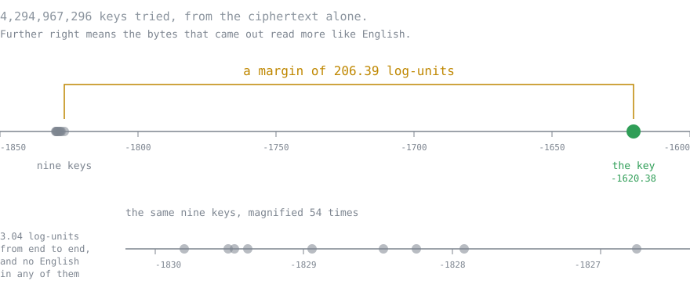
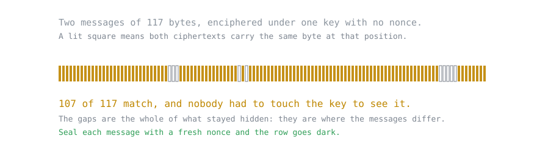

# byte-enigma

[](https://github.com/qnicondavid/byte-enigma/actions/workflows/build.yml)
[](LICENSE)
[](https://jitpack.io/#qnicondavid/byte-enigma)

A rotor cipher over bytes, and the code that breaks it.

The cipher has a 32-bit key. That is the entire secret, and this repository contains a search that
walks all four billion of them and gets the plaintext back. Both halves are the point: the interesting
part of a rotor machine is not that it enciphers, it is how it dies.

The whole keyspace has been swept, ciphertext only, with no crib and no hint about where to look. The
true key came first out of 4,294,967,296, by 206 log-units, in 62.2 minutes on sixteen threads.
[The log is in the repository.](docs/keyspace-sweep.md)

```
java -jar byte-enigma.jar demo
```

## What this is not

**It is not an Enigma simulator.** It will not decrypt a wartime message and it will not match a
historical test vector. The alphabet is 256 symbols rather than 26, the wirings come from the key
rather than from the eight catalogue rotors, there are no ring settings, and the stepping is a plain
odometer with no double-stepping anomaly. [ADR 0001](docs/adr/0001-derived-wiring-over-historical-rotors.md)
records why.

**It is not a secure cipher and is not on its way to becoming one.** A 32-bit key is small enough to
enumerate in an afternoon, there is no authentication, and the passphrase derivation is a hash rather
than a KDF. If you need real encryption, use libsodium, or `javax.crypto` with AES-GCM, or age.

**It is not a portfolio demo of a cipher.** The library worth depending on is
`io.github.qnicondavid.byteenigma.search`, which brute-forces a 32-bit keyspace across threads and
knows nothing about rotors. That part is [documented separately](docs/using-the-search.md).

## How the machine works

A byte goes in on the left and comes out on the left, having made a round trip.


The plugboard swaps it for another byte. Three rotors each swap it again, one after another. Then it
hits the reflector, which swaps it one last time and sends it back through the same three rotors in
reverse order, then back through the plugboard, and out.

Every one of those swaps is a permutation of all 256 byte values, and all of them are derived from
the key. So the key does not choose a setting on a fixed machine. It builds the machine.

Two things make the result more than a substitution cipher. The rotors turn: the first one advances
after every byte, and when it passes a mark of its own it kicks the second one along, the way an
odometer carries. So the same input byte at two positions meets two different permutations. And the
reflector is chosen so that it never maps a byte to itself, which has consequences the next section
is about.

## Why it can be broken

Two reasons, and the second is more interesting than the first.

**The key is 32 bits.** Everything above comes out of one `int`, so there are 4,294,967,296 machines
and you can build all of them. There is no cleverness to defeat here, only arithmetic: try every key,
keep the one whose output looks like English. What that costs is a measured hour, not an estimate.

**No byte ever encrypts to itself.** The reflector has no fixed points, and every rotor pass is built
on top of it, so the whole machine inherits the property. That is what makes one setting both encrypt
and decrypt, which is convenient. It is also a leak. If you think you know a fragment of the plaintext
but not where it sits, you can rule out any position where the fragment and the ciphertext agree on a
single byte, before trying one key. Bletchley Park leaned on this harder than on anything else.

Over 256 symbols the discount is thin, and that is worth saying plainly, because it is one of the few
places where this cipher is meaningfully weaker at being interesting than its ancestor.
[why-the-cipher-falls.md](docs/why-the-cipher-falls.md) has the five weaknesses and what each one
costs an attacker.

## Breaking it

The search decrypts under every key and keeps whichever result reads most like English, scored
against a table of four-letter frequencies built from about 670,000 words of public-domain prose. It
assumes the plaintext is English and nothing else, which is a far weaker assumption than knowing a
fragment of it, and it is roughly how a lot of real traffic was read.

```
byte-enigma break --language --in message.b64 --top 10
```

Run over the whole range against a 234-byte message, it takes 62.2 minutes on sixteen threads. This
is what came back.



The nine runners-up are not near-misses. They are the top of a noise distribution, and a magnifying
glass is needed to tell them apart at all. The key is not at the top of that distribution. It is not
in it.

If you do know a fragment, say a header or a name, the crib attack is faster:

```
byte-enigma offsets --crib "ATTACK AT DAWN" --in message.b64
byte-enigma break --crib "ATTACK AT DAWN" --at 0 --in message.b64
```

The first command lists the positions the no-fixed-point rule leaves standing, before any key is
tried. The second sweeps one of them. Over the whole keyspace this route came back in 40.8 minutes
with one key and nothing else. Measured on the rate each run settled at over its last quarter, that
is 49% more keys per second than reading the English. Not an order of magnitude, because both spend
most of their time rebuilding the key schedule and neither can avoid it.
[keyspace-sweep.md](docs/keyspace-sweep.md) has both runs and [benchmarks.md](docs/benchmarks.md)
has where the time inside one candidate goes.

## The leak that needs no key

Recovering a key is the loud failure. Here is the quiet one, and it is the one that would bite a real
user first.

`transform(byte[], byte[])` takes the rotor offsets from the key alone and resets them at the start of
every call. So the permutation applied to byte 4 depends only on the key and on the number 4. Encipher
two messages under one key and, wherever the plaintexts agree at the same offset, the ciphertexts
agree there too.



Nobody attacked the key to produce that row. Two messages went past and the pattern fell out. Send
enough traffic under one key and each position becomes an ordinary substitution cipher with a
frequency distribution to attack, which is the depth attack, and it does not require breaking the key
at all.

The fix is a nonce. `transform(byte[], byte[], long)` derives the offsets from key and nonce together,
and `Envelope` draws a fresh one per message and ships it in the clear ahead of the ciphertext. The
textbook mode stays in the API on purpose: it is what the breaker attacks and what the demo
demonstrates, and a repository about how ciphers fail should keep the failure reachable.

Note what the nonce does not fix. It is not key material and it travels in the clear, so the search is
exactly as fast against sealed messages as against raw ones.
`BreakerEndToEndTest.aNonceDoesNotProtectTheKeyOnceItTravelsInTheClear` is that test.

## What the demo shows

```
$ byte-enigma demo
...
  crib, known plaintext
    key:        -1722875331  (correct)
    plaintext:  THE ENEMY FLEET WILL SAIL AT DAWN AND ATTACK THE SOUTHERN HARBOUR ...
    rate:       383,173 keys/sec, so 2^32 projects to 3.11 h
```

Two things, in order. First the key reuse above, with the matching positions counted for you, and
then the same two messages sealed with a nonce so you can watch the correspondence vanish. Then a key
is drawn at random, a message is enciphered under it, and the key is thrown away. The search recovers
it twice, once with a crib and once from the ciphertext alone, and prints the measured rate both
times.

The demo searches a window of about a million keys so it finishes while you are watching. The window
is the only thing scaled down. The same code handed the full range sweeps the full range, which is
what [keyspace-sweep.md](docs/keyspace-sweep.md) records.

## Getting it

Download `byte-enigma.jar` from [the latest release](https://github.com/qnicondavid/byte-enigma/releases/latest)
and run it. There are no dependencies to fetch.

```
java -jar byte-enigma.jar demo
```

Or build it yourself; you need JDK 17 or newer and Maven.

```
git clone https://github.com/qnicondavid/byte-enigma.git
cd byte-enigma
mvn -q -Pdist package
java -jar core/target/byte-enigma.jar demo
```

## Using it as a library

Available through [JitPack](https://jitpack.io/#qnicondavid/byte-enigma). The part worth reusing is
`SeedSweep`, which has no idea a cipher exists. It owns the range, the worker threads, the leaderboard
and the clock; you supply a factory for whatever gets rekeyed and an evaluator that scores one
candidate. Point it at something else and it will brute-force that instead.

[Using the search](docs/using-the-search.md) has the coordinates, a worked example, and the cipher's
own API.

## Layout

```
core/                the cipher, the search, the breaker, the command line
benchmarks/          JMH benchmarks, in the reactor build so they cannot rot unnoticed
tools/               draws the figures in docs/ from the data the repository commits
data/corpus/         public-domain English the quadgram table is generated from
docs/                the decision record, how the cipher falls, the sweeps, the benchmarks
```

Inside `core`:

| Package | What is in it |
|---|---|
| `...byteenigma.cipher` | `ByteEnigma`, `Envelope`, and the rotors and involutions behind them |
| `...byteenigma.search` | `SeedSweep` and friends. Knows nothing about ciphers. |
| `...byteenigma.breaker` | `CribMatcher`, `QuadgramSearch`, `QuadgramScorer`. The parts that do know. |
| `...byteenigma.cli` | Argument parsing and the subcommands |

## Building

```
mvn verify                   # 153 tests, 4 to 6 s on one desktop
mvn -Pdist package           # builds core/target/byte-enigma.jar
mvn -pl benchmarks -am package   # builds benchmarks/target/benchmarks.jar
java -jar benchmarks/target/benchmarks.jar
```

Two derived things are committed next to the data they come from, and a test fails the build if
either drifts. The quadgram table under `core/src/main/resources` is generated from `data/corpus`,
and the figures in `docs/` are drawn by `tools/` from the committed sweep checkpoints and from the
cipher itself. To rebuild them:

```
mvn -q -pl core -am compile exec:java -Dexec.mainClass=io.github.qnicondavid.byteenigma.breaker.QuadgramTableBuilder
mvn -q -pl tools -am compile exec:java@diagrams
```

Then commit the source and the regenerated file together.

## Reading further

- [docs/why-the-cipher-falls.md](docs/why-the-cipher-falls.md): the five weaknesses, what each one
  costs the attacker, and which of them a nonce fixes.
- [docs/keyspace-sweep.md](docs/keyspace-sweep.md): both full sweeps, their logs, and why a headline
  rate figure is the one number on the page you should not quote.
- [docs/benchmarks.md](docs/benchmarks.md): where the time inside one candidate goes, measured, and
  the two things these docs used to claim that the measurement does not support.
- [docs/using-the-search.md](docs/using-the-search.md): the reusable half, with coordinates and an
  example.
- [docs/adr/0001-derived-wiring-over-historical-rotors.md](docs/adr/0001-derived-wiring-over-historical-rotors.md)
  explains why 256 symbols and key-derived wiring instead of the historical machine.
- [CHANGELOG.md](CHANGELOG.md), including the two times the golden vector was deliberately rebased.
- [SECURITY.md](SECURITY.md): what is worth reporting, given that the cipher being weak is the
  specification rather than a finding.

## License

MIT. See [LICENSE](LICENSE). The corpus texts are public domain; their provenance is in
[data/corpus/MANIFEST.md](data/corpus/MANIFEST.md).
