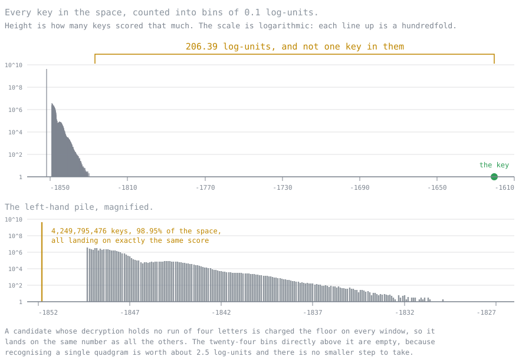

# Sweeping the whole keyspace

All 4,294,967,296 keys. Twice: once from the ciphertext alone with no crib and no hint, and once
with an eighteen-byte crib. The true key came first both times, and it was the only thing the crib
run found in the whole space.

Every keys/sec figure in this project is measured on work that actually ran, and this page is where
those measurements come from.

## The setup

| | |
|---|---|
| Ciphertext | 234 bytes of English, enciphered in textbook mode with 3 rotors |
| Key | 2083951437 |
| Range | `[-2147483648, 2147483648)`, all 4,294,967,296 keys |
| Attack | Ciphertext only. No crib, no hint about where in the range to look. |

The key sits 98.5% of the way up from the bottom of the range on purpose. The sweep starts at
`Integer.MIN_VALUE` and counts up, so a key placed near the top is only found by a run that really
did go nearly all the way.

The ciphertext, Base64, SHA-256 `35de936d3adfe362561c02f3bb95e75b2c5ff74a279b2e397c43cf5a9d3cf2d2`:

```
h0K7ne80iRrdqDBrrfJntmcbDyT2JahUyRzRLq/wJLsyq7jRaF0sPoal87B+NDkTulzn3bae+UAsmWr+1sYeGa4IY+SP
9Ab364XqZWIuidfuzuzR3Kz1R/EzN5dGcLsACH1XTD6sfG968KgXYKvEXnNsLlHTk4CVo+aAEn078TAiuO7AZtLKUhA/
7479zl9KmeCmDpVV8bDSBIwEptp88DPWHcVgiZ0CqQEIUQQl8sfQThGHl/frEr+ZEo2F6d5sfXGBJZ5vdr1gx9vhoQGO
vxdco5h5HYwL5pmgUbzNRL4l1XNc4IfZajuS
```

## The result

| | key | score |
|---|---|---|
| **1** | **2083951437** | **-1620.38** |
| 2 | -1131398620 | -1826.76 |
| 3 | 628210969 | -1827.92 |
| 4 | -1684917101 | -1828.24 |
| 5 | 552358186 | -1828.46 |

The first entry is the key. It was not given to the search, and the search was not told where to
look; it walked every key in the space and this one scored highest.

**The margin is 206.39 log-units.** The nine runners-up span 3.04 log-units, from -1826.76 down to
-1829.81, which is what the top of a noise distribution looks like when nothing in it is English.
The key is not at the top of that distribution. It is not in it.

Some of the runners-up show what the scorer is rewarding: key -1131398620 produced the fragment
`APtIO`, key 628210969 produced `NEReNdiN`, and key -1321375626 produced `mUsTIReD`. Two or three
accidental four-letter hits lift a candidate a little above pure noise. Across four billion attempts
the best accident was worth 206 log-units less than the real thing, which is the number the whole
ciphertext-only attack rests on.

That leaderboard has now been produced twice, by runs two days apart, on either side of a batch of
changes to the tests, the build and the benchmarks. Every one of the ten scores came back identical
to the last decimal, and so did the margin. Nothing that happened to this repository between the two
runs touched the cipher or the scorer, and that is not an argument, it is the second run.

The crib attack over the same range returned **one key and nothing else**: 2083951437, scoring the
full eighteen bytes. A wrong key matches an eighteen-byte crib with probability 256^-18, so across
2^32 keys the expected number of false positives is about 2 x 10^-34, and the run agrees with the
arithmetic. The checkpoint it left is 554 bytes with a single `best=` line in it, which is the whole
of the evidence.

## What the other four billion scored

The leaderboard says the margin is 206.39 log-units. It cannot say what 206 is large compared to.
Counting every score into bins of a tenth of a unit answers that.



Three things happen, and the first is almost all of the space.

**Nothing is recognised.** 4,249,795,476 keys, 98.95% of the keyspace, land on one score. Not near
each other, the same: they share a single bin, and the twenty-four bins above it hold nothing at all.
A candidate whose decrypted bytes contain no run of four letters is charged the floor on every
window, so its total is a constant, and most decryptions under a wrong key contain no such run.

**Something is recognised by accident.** The other 1.05%, about 45 million keys, spread over 25
log-units and thin out fast. 1,246,767 score above -1845, then 23,507 above -1840, then 478 above
-1835, then eleven above -1830, then two above -1827. The last of them, at -1826.76, is the best
accident in the whole space.

**English is recognised.** One key, with 2,063 empty bins between it and the nearest thing that is
not it.

That last number is the one worth carrying away. The entire noise distribution, floor to best
accident, is 25.00 log-units wide. The margin is 8.3 times that. The key is not at the top of the
distribution and it is not in its tail. It is more than eight distribution-widths past the end of it.

The file the run wrote is committed as `score-histogram.tsv`, 199 populated bins out of 7,000, and
the figure above is drawn from it by `tools/`.

## Rates

Both sweeps below are single uninterrupted runs of the whole range on sixteen threads of one
machine, an hour apart, against the same ciphertext.

| | keys | threads | wall clock | rate as reported |
|---|---|---|---|---|
| Crib, `THIRTY TWO BIT KEY` at 36 | 4,294,967,296 | 16 | 40.8 min | 1,755,375 keys/sec |
| Ciphertext only, quadgrams | 4,294,967,296 | 16 | 62.2 min | 1,150,873 keys/sec |

**Neither headline figure is the rate the machine sustains.** Both runs start fast and settle: the
crib run's first 67 million keys went at 2,448,423 keys/sec and its last quarter of the range at
1,688,273, and the ciphertext-only run started at 1,559,100 and settled at 1,132,639. The machine
opens between 1.38 and 1.45 times faster than it holds, so a cumulative average taken over a whole
run is 2 to 4% above the sustained rate, and more than that for a short run. The progress lines
below make it visible: the rate column falls monotonically for an hour.

This is the same disease as the 587,309 keys/sec an earlier run reported, only milder. That run was
resumed across two thread counts and its checkpoint blended the elapsed time of both, which made the
number meaningless about any configuration. These two were run in one piece precisely so that would
not happen, and they still carry the turbo at the front of them.

For what it is worth against the older figures: that run measured 805,923 keys/sec on sixteen
threads for the ciphertext-only attack. The same attack on the same machine measures 1,150,873 here,
1.43 times more. The earlier run was slow, and the section below is about why.

## How much the crib really saves

| | crib | ciphertext only | crib is faster by |
|---|---|---|---|
| one candidate, JMH, 234 bytes | 3.743 us | 5.073 us | 35.5% |
| whole keyspace, as reported | 1,755,375 keys/sec | 1,150,873 keys/sec | 52.5% |
| whole keyspace, last quarter | 1,688,273 keys/sec | 1,132,639 keys/sec | 49.1% |

The crib attack is worth about half again, not an order of magnitude, and this page used to say 40%
on the strength of two partial runs. The number to quote is the last row: two complete sweeps, one
machine, one afternoon.

The interesting part is that the sweep advantage is larger than the evaluator advantage. At the
level of one candidate the crib route saves 36%; over four billion of them it saves 49%. The extra
comes from what `SeedSweep` does around the evaluator rather than inside it. `QuadgramSearch`
returns a `Candidate` for every key, which is an allocation and a leaderboard comparison four
billion times. `CribMatcher` returns `null` unless every crib byte matches, so it allocates once, on
the one key in four billion that survives. Measured against the JMH figures, a key inside the
ciphertext-only sweep costs 2.78 times what its evaluator costs alone, and a key inside the crib
sweep 2.53 times. The rest of that multiple is the sixteen threads: six performance cores and ten
efficiency-class ones, at sustained load.

That is also why the projection made before these runs was wrong. It scaled by the evaluator ratio,
1.311 in the benchmark run the page then had, and predicted 53 minutes for the ciphertext-only sweep
against the 62.2 it took, 16% out. Scaled by the sweep ratio it would have been 2% out. Neither
attack's cost is the evaluator's cost.

## What these rates do not reconcile with

They reconcile now, and the answer was not the software.

[benchmarks.md](benchmarks.md) drives `SeedSweep` itself through JMH. Its own cost comes out under
about 3% of a candidate, which is as tight as that suite can put it, and two threads scale at 93.5%
of one. The gap between the earlier run's figures and what this code does was never `SeedSweep`. It
was that run's conditions, and two independent measurements agree on the size of it: at two threads,
JMH reaches 370,287 keys/sec against the 229,762 that run measured, 1.61 times; and the crib sweep
here came in 1.66 times faster than a projection built on that run's sixteen-thread rate.

So the figures from that run were roughly 1.6 times below what the machine does, at every thread
count, for reasons nobody recorded at the time. The two runs on this page replace them.

## Reproducing it

Save the Base64 above to `message.b64`.

```
byte-enigma break --language --in message.b64 --top 10 --checkpoint sweep.state
byte-enigma break --crib "THIRTY TWO BIT KEY" --at 36 --in message.b64 --top 10 --checkpoint crib.state
```

Both default to the entire keyspace and are told nothing else. Add `--threads` to pin the count; the
runs here used 16. Add `--histogram <file>` to the language sweep and it writes the distribution as
well as the leaderboard, which costs about 2.4% of the run. That figure is this pair of runs, 63.7
minutes against 62.2. The microbenchmark that should settle it does not agree with itself; see
[benchmarks.md](benchmarks.md#what-the-histogram-costs).

`--checkpoint` is what makes a run this long practical. The sweep walks the range in segments and
records where it got to after each one, so it can be stopped at any point and picked up by running
the same command again. `--for 3600` time-boxes a run: it stops after roughly an hour, checkpoints,
and exits 3 to say there is range left. The checkpoint carries a SHA-256 of the ciphertext along
with the mode and the range, and refuses to resume unless all three match, so it cannot quietly
continue against a different message.

Resuming is what ruins a rate, though, so if the number matters, run it in one piece at a fixed
thread count and read the tail rather than the total.

Before the crib sweep, `byte-enigma offsets --crib "THIRTY TWO BIT KEY" --in message.b64` reports
which positions survive the no-fixed-point rule. On this message it eliminates 6 of 217, 2.8%; see
[why-the-cipher-falls.md](why-the-cipher-falls.md#2-no-byte-ever-encrypts-to-itself) for why that is
well under the 6.8% the formula gives.

`docs/keyspace-sweep.state` and `docs/crib-sweep.state` are the checkpoints the two completed runs
left behind, cursors at the end of the range. They are committed so the results can be inspected
without repeating the hour.

## The logs

Both runs in full, as the tool printed them. The rate column is cumulative from the start of the
run, which is why it falls for an hour and settles rather than holding steady.

### Ciphertext only, 62.2 minutes

```
ciphertext: 234 bytes, sha-256 35de936d3adfe362
mode:       ciphertext-only quadgram search
range:      [-2147483648, 2147483648)  4294967296 keys
threads:    16
checkpoint: language.state  (new)
resumed:    0 keys already done, 0.0% of the range
    1.56%       67,108,864 keys  1,559,100 keys/sec  this run 43.0 s  total 43.0 s
    3.13%      134,217,728 keys  1,524,885 keys/sec  this run 88.0 s  total 88.0 s
    4.69%      201,326,592 keys  1,443,984 keys/sec  this run 2.3 min  total 2.3 min
    6.25%      268,435,456 keys  1,389,591 keys/sec  this run 3.2 min  total 3.2 min
    7.81%      335,544,320 keys  1,354,049 keys/sec  this run 4.1 min  total 4.1 min
    9.38%      402,653,184 keys  1,325,284 keys/sec  this run 5.1 min  total 5.1 min
   10.94%      469,762,048 keys  1,296,675 keys/sec  this run 6.0 min  total 6.0 min
   12.50%      536,870,912 keys  1,273,921 keys/sec  this run 7.0 min  total 7.0 min
   14.06%      603,979,776 keys  1,257,762 keys/sec  this run 8.0 min  total 8.0 min
   15.63%      671,088,640 keys  1,248,012 keys/sec  this run 9.0 min  total 9.0 min
   17.19%      738,197,504 keys  1,238,123 keys/sec  this run 9.9 min  total 9.9 min
   18.75%      805,306,368 keys  1,229,179 keys/sec  this run 10.9 min  total 10.9 min
   20.31%      872,415,232 keys  1,222,135 keys/sec  this run 11.9 min  total 11.9 min
   21.88%      939,524,096 keys  1,212,856 keys/sec  this run 12.9 min  total 12.9 min
   23.44%    1,006,632,960 keys  1,209,068 keys/sec  this run 13.9 min  total 13.9 min
   25.00%    1,073,741,824 keys  1,203,617 keys/sec  this run 14.9 min  total 14.9 min
   26.56%    1,140,850,688 keys  1,201,133 keys/sec  this run 15.8 min  total 15.8 min
   28.13%    1,207,959,552 keys  1,199,438 keys/sec  this run 16.8 min  total 16.8 min
   29.69%    1,275,068,416 keys  1,195,205 keys/sec  this run 17.8 min  total 17.8 min
   31.25%    1,342,177,280 keys  1,194,011 keys/sec  this run 18.7 min  total 18.7 min
   32.81%    1,409,286,144 keys  1,192,449 keys/sec  this run 19.7 min  total 19.7 min
   34.38%    1,476,395,008 keys  1,189,681 keys/sec  this run 20.7 min  total 20.7 min
   35.94%    1,543,503,872 keys  1,188,400 keys/sec  this run 21.6 min  total 21.6 min
   37.50%    1,610,612,736 keys  1,184,692 keys/sec  this run 22.7 min  total 22.7 min
   39.06%    1,677,721,600 keys  1,183,562 keys/sec  this run 23.6 min  total 23.6 min
   40.63%    1,744,830,464 keys  1,182,173 keys/sec  this run 24.6 min  total 24.6 min
   42.19%    1,811,939,328 keys  1,181,263 keys/sec  this run 25.6 min  total 25.6 min
   43.75%    1,879,048,192 keys  1,180,211 keys/sec  this run 26.5 min  total 26.5 min
   45.31%    1,946,157,056 keys  1,178,794 keys/sec  this run 27.5 min  total 27.5 min
   46.88%    2,013,265,920 keys  1,177,532 keys/sec  this run 28.5 min  total 28.5 min
   48.44%    2,080,374,784 keys  1,177,359 keys/sec  this run 29.4 min  total 29.4 min
   50.00%    2,147,483,648 keys  1,175,674 keys/sec  this run 30.4 min  total 30.4 min
   51.56%    2,214,592,512 keys  1,173,367 keys/sec  this run 31.5 min  total 31.5 min
   53.13%    2,281,701,376 keys  1,173,250 keys/sec  this run 32.4 min  total 32.4 min
   54.69%    2,348,810,240 keys  1,172,313 keys/sec  this run 33.4 min  total 33.4 min
   56.25%    2,415,919,104 keys  1,169,985 keys/sec  this run 34.4 min  total 34.4 min
   57.81%    2,483,027,968 keys  1,169,217 keys/sec  this run 35.4 min  total 35.4 min
   59.38%    2,550,136,832 keys  1,168,130 keys/sec  this run 36.4 min  total 36.4 min
   60.94%    2,617,245,696 keys  1,167,499 keys/sec  this run 37.4 min  total 37.4 min
   62.50%    2,684,354,560 keys  1,167,029 keys/sec  this run 38.3 min  total 38.3 min
   64.06%    2,751,463,424 keys  1,165,712 keys/sec  this run 39.3 min  total 39.3 min
   65.63%    2,818,572,288 keys  1,164,755 keys/sec  this run 40.3 min  total 40.3 min
   67.19%    2,885,681,152 keys  1,161,167 keys/sec  this run 41.4 min  total 41.4 min
   68.75%    2,952,790,016 keys  1,159,640 keys/sec  this run 42.4 min  total 42.4 min
   70.31%    3,019,898,880 keys  1,159,060 keys/sec  this run 43.4 min  total 43.4 min
   71.88%    3,087,007,744 keys  1,157,896 keys/sec  this run 44.4 min  total 44.4 min
   73.44%    3,154,116,608 keys  1,157,405 keys/sec  this run 45.4 min  total 45.4 min
   75.00%    3,221,225,472 keys  1,156,786 keys/sec  this run 46.4 min  total 46.4 min
   76.56%    3,288,334,336 keys  1,156,285 keys/sec  this run 47.4 min  total 47.4 min
   78.13%    3,355,443,200 keys  1,155,540 keys/sec  this run 48.4 min  total 48.4 min
   79.69%    3,422,552,064 keys  1,154,893 keys/sec  this run 49.4 min  total 49.4 min
   81.25%    3,489,660,928 keys  1,154,252 keys/sec  this run 50.4 min  total 50.4 min
   82.81%    3,556,769,792 keys  1,153,573 keys/sec  this run 51.4 min  total 51.4 min
   84.38%    3,623,878,656 keys  1,152,874 keys/sec  this run 52.4 min  total 52.4 min
   85.94%    3,690,987,520 keys  1,152,626 keys/sec  this run 53.4 min  total 53.4 min
   87.50%    3,758,096,384 keys  1,152,301 keys/sec  this run 54.4 min  total 54.4 min
   89.06%    3,825,205,248 keys  1,152,312 keys/sec  this run 55.3 min  total 55.3 min
   90.63%    3,892,314,112 keys  1,151,590 keys/sec  this run 56.3 min  total 56.3 min
   92.19%    3,959,422,976 keys  1,151,368 keys/sec  this run 57.3 min  total 57.3 min
   93.75%    4,026,531,840 keys  1,150,930 keys/sec  this run 58.3 min  total 58.3 min
   95.31%    4,093,640,704 keys  1,150,806 keys/sec  this run 59.3 min  total 59.3 min
   96.88%    4,160,749,568 keys  1,150,657 keys/sec  this run 60.3 min  total 60.3 min
   98.44%    4,227,858,432 keys  1,150,739 keys/sec  this run 61.2 min  total 61.2 min
  100.00%    4,294,967,296 keys  1,150,873 keys/sec  this run 62.2 min  total 62.2 min

keys tried:  4,294,967,296  (whole range)
elapsed:     62.2 min
rate:        1,150,873 keys/sec (measured over the work actually done)

margin:      206.39 between the first and the second

#1  key=2083951437  score=-1620.38
    THE CIPHER IN THIS REPOSITORY HAS A THIRTY TWO BIT KEY AND THAT IS THE WHOLE OF THE SECRET SO
    ANY MACHINE CAN TRY EVERY KEY IN TURN UNTIL THE PLAINTEXT COMES BACK OUT WHICH IS EXACTLY WHAT
    THE SWEEP RECORDED IN THIS FILE SET OUT TO DO
#2  key=-1131398620  score=-1826.76
#3  key=628210969    score=-1827.92
#4  key=-1684917101  score=-1828.24
#5  key=552358186    score=-1828.46
#6  key=1203253946   score=-1828.94
#7  key=398586806    score=-1829.38
#8  key=139932621    score=-1829.46
#9  key=127748316    score=-1829.51
#10 key=-1321375626  score=-1829.81
```

### Crib, 40.8 minutes

The leaderboard is one line long. That is the result.

```
ciphertext: 234 bytes, sha-256 35de936d3adfe362
mode:       crib "THIRTY TWO BIT KEY" at offset 36
range:      [-2147483648, 2147483648)  4294967296 keys
threads:    16
checkpoint: crib.state  (new)
resumed:    0 keys already done, 0.0% of the range
    1.56%       67,108,864 keys  2,448,423 keys/sec  this run 27.4 s  total 27.4 s
    3.13%      134,217,728 keys  2,320,792 keys/sec  this run 57.8 s  total 57.8 s
    4.69%      201,326,592 keys  2,279,408 keys/sec  this run 88.3 s  total 88.3 s
    6.25%      268,435,456 keys  2,247,847 keys/sec  this run 2.0 min  total 2.0 min
    7.81%      335,544,320 keys  2,193,296 keys/sec  this run 2.5 min  total 2.5 min
    9.38%      402,653,184 keys  2,155,766 keys/sec  this run 3.1 min  total 3.1 min
   10.94%      469,762,048 keys  2,124,647 keys/sec  this run 3.7 min  total 3.7 min
   12.50%      536,870,912 keys  2,096,666 keys/sec  this run 4.3 min  total 4.3 min
   14.06%      603,979,776 keys  2,072,607 keys/sec  this run 4.9 min  total 4.9 min
   15.63%      671,088,640 keys  2,049,261 keys/sec  this run 5.5 min  total 5.5 min
   17.19%      738,197,504 keys  2,028,151 keys/sec  this run 6.1 min  total 6.1 min
   18.75%      805,306,368 keys  2,007,655 keys/sec  this run 6.7 min  total 6.7 min
   20.31%      872,415,232 keys  1,986,752 keys/sec  this run 7.3 min  total 7.3 min
   21.88%      939,524,096 keys  1,966,579 keys/sec  this run 8.0 min  total 8.0 min
   23.44%    1,006,632,960 keys  1,947,423 keys/sec  this run 8.6 min  total 8.6 min
   25.00%    1,073,741,824 keys  1,931,100 keys/sec  this run 9.3 min  total 9.3 min
   26.56%    1,140,850,688 keys  1,916,867 keys/sec  this run 9.9 min  total 9.9 min
   28.13%    1,207,959,552 keys  1,904,663 keys/sec  this run 10.6 min  total 10.6 min
   29.69%    1,275,068,416 keys  1,893,705 keys/sec  this run 11.2 min  total 11.2 min
   31.25%    1,342,177,280 keys  1,883,233 keys/sec  this run 11.9 min  total 11.9 min
   32.81%    1,409,286,144 keys  1,873,934 keys/sec  this run 12.5 min  total 12.5 min
   34.38%    1,476,395,008 keys  1,865,798 keys/sec  this run 13.2 min  total 13.2 min
   35.94%    1,543,503,872 keys  1,858,616 keys/sec  this run 13.8 min  total 13.8 min
   37.50%    1,610,612,736 keys  1,852,246 keys/sec  this run 14.5 min  total 14.5 min
   39.06%    1,677,721,600 keys  1,846,599 keys/sec  this run 15.1 min  total 15.1 min
   40.63%    1,744,830,464 keys  1,841,407 keys/sec  this run 15.8 min  total 15.8 min
   42.19%    1,811,939,328 keys  1,836,195 keys/sec  this run 16.4 min  total 16.4 min
   43.75%    1,879,048,192 keys  1,831,081 keys/sec  this run 17.1 min  total 17.1 min
   45.31%    1,946,157,056 keys  1,826,377 keys/sec  this run 17.8 min  total 17.8 min
   46.88%    2,013,265,920 keys  1,822,057 keys/sec  this run 18.4 min  total 18.4 min
   48.44%    2,080,374,784 keys  1,818,088 keys/sec  this run 19.1 min  total 19.1 min
   50.00%    2,147,483,648 keys  1,814,667 keys/sec  this run 19.7 min  total 19.7 min
   51.56%    2,214,592,512 keys  1,811,140 keys/sec  this run 20.4 min  total 20.4 min
   53.13%    2,281,701,376 keys  1,807,995 keys/sec  this run 21.0 min  total 21.0 min
   54.69%    2,348,810,240 keys  1,805,068 keys/sec  this run 21.7 min  total 21.7 min
   56.25%    2,415,919,104 keys  1,802,152 keys/sec  this run 22.3 min  total 22.3 min
   57.81%    2,483,027,968 keys  1,799,581 keys/sec  this run 23.0 min  total 23.0 min
   59.38%    2,550,136,832 keys  1,797,106 keys/sec  this run 23.7 min  total 23.7 min
   60.94%    2,617,245,696 keys  1,794,768 keys/sec  this run 24.3 min  total 24.3 min
   62.50%    2,684,354,560 keys  1,792,615 keys/sec  this run 25.0 min  total 25.0 min
   64.06%    2,751,463,424 keys  1,790,623 keys/sec  this run 25.6 min  total 25.6 min
   65.63%    2,818,572,288 keys  1,788,817 keys/sec  this run 26.3 min  total 26.3 min
   67.19%    2,885,681,152 keys  1,786,863 keys/sec  this run 26.9 min  total 26.9 min
   68.75%    2,952,790,016 keys  1,784,997 keys/sec  this run 27.6 min  total 27.6 min
   70.31%    3,019,898,880 keys  1,783,152 keys/sec  this run 28.2 min  total 28.2 min
   71.88%    3,087,007,744 keys  1,781,495 keys/sec  this run 28.9 min  total 28.9 min
   73.44%    3,154,116,608 keys  1,779,806 keys/sec  this run 29.5 min  total 29.5 min
   75.00%    3,221,225,472 keys  1,778,274 keys/sec  this run 30.2 min  total 30.2 min
   76.56%    3,288,334,336 keys  1,776,870 keys/sec  this run 30.8 min  total 30.8 min
   78.13%    3,355,443,200 keys  1,775,717 keys/sec  this run 31.5 min  total 31.5 min
   79.69%    3,422,552,064 keys  1,774,299 keys/sec  this run 32.1 min  total 32.1 min
   81.25%    3,489,660,928 keys  1,773,226 keys/sec  this run 32.8 min  total 32.8 min
   82.81%    3,556,769,792 keys  1,772,236 keys/sec  this run 33.4 min  total 33.4 min
   84.38%    3,623,878,656 keys  1,770,467 keys/sec  this run 34.1 min  total 34.1 min
   85.94%    3,690,987,520 keys  1,768,791 keys/sec  this run 34.8 min  total 34.8 min
   87.50%    3,758,096,384 keys  1,767,104 keys/sec  this run 35.4 min  total 35.4 min
   89.06%    3,825,205,248 keys  1,765,350 keys/sec  this run 36.1 min  total 36.1 min
   90.63%    3,892,314,112 keys  1,763,877 keys/sec  this run 36.8 min  total 36.8 min
   92.19%    3,959,422,976 keys  1,762,366 keys/sec  this run 37.4 min  total 37.4 min
   93.75%    4,026,531,840 keys  1,760,919 keys/sec  this run 38.1 min  total 38.1 min
   95.31%    4,093,640,704 keys  1,759,423 keys/sec  this run 38.8 min  total 38.8 min
   96.88%    4,160,749,568 keys  1,758,196 keys/sec  this run 39.4 min  total 39.4 min
   98.44%    4,227,858,432 keys  1,756,985 keys/sec  this run 40.1 min  total 40.1 min
  100.00%    4,294,967,296 keys  1,755,375 keys/sec  this run 40.8 min  total 40.8 min

keys tried:  4,294,967,296  (whole range)
elapsed:     40.8 min
rate:        1,755,375 keys/sec (measured over the work actually done)

#1  key=2083951437  score=18.00
    THE CIPHER IN THIS REPOSITORY HAS A THIRTY TWO BIT KEY AND THAT IS THE WHOLE OF THE SECRET SO
    ANY MACHINE CAN TRY EVERY KEY IN TURN UNTIL THE PLAINTEXT COMES BACK OUT WHICH IS EXACTLY WHAT
    THE SWEEP RECORDED IN THIS FILE SET OUT TO DO
```
